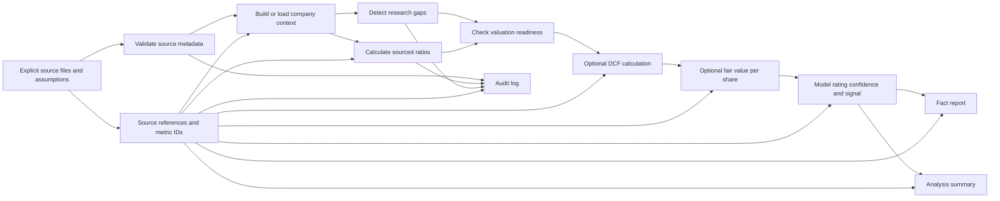
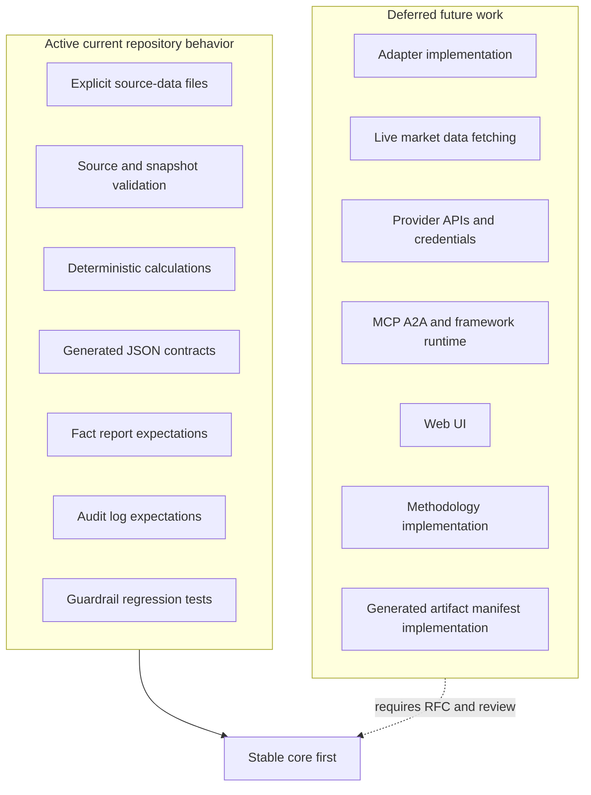

# Architecture Visual Overview

This document gives maintainers and future Codex reviewers a visual map of the
current post-v1.1.9 architecture. The project is a deterministic,
evidence-based financial analysis core for the supported sample companies. It
uses explicit source files, validation, schemas, generated-output contracts,
audit logs, and guardrail tests to keep facts, assumptions, calculations, and
model outputs separate. It does not provide investment advice, price targets,
buy/sell/hold recommendations, trading logic, portfolio automation, hidden live
data fetching, or adapter runtime behavior.

## High-Level Layered Architecture

```mermaid
flowchart TB
    subgraph Deferred["Deferred adapter and interface layers"]
        Adapters["Adapters and Market Data Agent"]
        LiveData["Live data and provider APIs"]
        MCPA2A["MCP A2A and framework adapters"]
        WebUI["Web UI"]
    end

    subgraph Governance["Governance and review layer"]
        AgentRules["AGENTS.md rules"]
        DataChecklist["Data contract review"]
        Guardrails["Guardrail security test plan"]
        AdapterRFC["Adapter boundary RFC"]
        ReleaseGov["Release and tag governance"]
    end

    subgraph Core["Deterministic core"]
        Validation["Source validation"]
        Context["Company context"]
        Gaps["Research gaps"]
        Ratios["Ratio calculation"]
        Readiness["Valuation readiness"]
        DCF["DCF scenarios"]
        FairValue["Fair value per share"]
        Rating["Model rating"]
        Confidence["Model confidence"]
        Signal["Model signal"]
    end

    subgraph Artifacts["Generated artifacts"]
        FactReport["Fact report Markdown"]
        Summary["Analysis summary JSON"]
        Audit["Audit log JSONL"]
        Contracts["Output schemas and expectations"]
    end

    Deferred -. "future only" .-> Governance
    Governance --> Core
    Core --> Artifacts
```

The deferred layer is shown above the governance layer because it must pass
architecture, data-contract, guardrail, risk, and decision-record review before
implementation. It is not part of the current runtime.

## Data Flow And Evidence Traceability

Every financial figure must remain traceable through source metadata such as
source URL, source date, unit, period, confidence, and stable metric identifiers
where applicable. Generated reports and summaries should expose missing data,
warnings, assumptions, and source references rather than hiding them in prose.

## Active Versus Deferred Layers

| Layer or capability | Current status | Boundary |
| --- | --- | --- |
| Explicit source files | Active | Must pass source validation before use. |
| Stored market price snapshots | Active | Snapshot records only; no hidden live refresh. |
| Deterministic core calculations | Active | Runs from explicit inputs and validated artifacts. |
| Generated-output contracts | Active | JSON outputs are protected where contracts exist. |
| Fact report and audit log expectations | Active | Expectations documented without parser or standalone audit schema. |
| Adapters and Market Data Agent | Deferred | Planning only; no concrete first consumer exists. |
| Live data and provider APIs | Deferred | Must remain outside core modules. |
| MCP, A2A, framework adapters, and web UI | Deferred | Later adapter topics, not current implementation tasks. |
| Methodology implementation | Deferred | Future boundary-sensitive work, not active behavior. |
| Generated artifact manifest | Deferred | Waits for a concrete consumer or review gap. |

## Guardrail Summary

The current architecture is built around fail-closed evidence discipline:

- Do not fabricate data, sources, periods, units, confidence, or assumptions.
- Do not imply hidden live-data fetching or automatic market-price refreshes.
- Do not produce buy/sell/hold recommendations.
- Do not produce price targets.
- Do not provide personal investment advice.
- Do not add trading logic, broker/order behavior, or portfolio automation.

Model rating, model confidence, and model signal outputs are deterministic
model artifacts only. They must not be reframed as recommendations or personal
advice.

## Deferred Items

The following remain explicitly deferred after v1.1.9:

- adapter implementation
- live data fetching
- provider APIs and credentials
- MCP or A2A runtime integration
- web UI
- methodology implementation
- generated artifact manifest implementation

`docs/ADAPTER_IMPLEMENTATION_READINESS_ASSESSMENT.md` records that the project
is ready only for mock/offline adapter planning. `docs/MOCK_OFFLINE_ADAPTER_CONSUMER_DECISION.md`
records that no concrete first mock/offline adapter consumer exists yet.

## How To Read This Architecture

Use this overview as a first-pass navigation map, not as a replacement for the
underlying contracts. If a proposed change touches data shape, generated
artifacts, adapters, reports, summaries, audit logs, or guardrails, follow the
linked governance documents in `docs/ARCHITECTURE_GOVERNANCE_INDEX.md`.

For future Codex or reviewer work:

1. Identify whether the change is inside the deterministic core, generated
   artifact surface, governance layer, or deferred adapter/interface layer.
2. Confirm the change does not bypass source validation, schema validation,
   audit logging, or guardrail tests.
3. Keep adapter, live-data, MCP/A2A, web UI, methodology implementation, and
   manifest implementation work deferred unless a concrete reviewed proposal
   exists.
4. Preserve the project boundary: analysis artifacts are not investment advice,
   recommendations, price targets, trading guidance, or portfolio automation.
